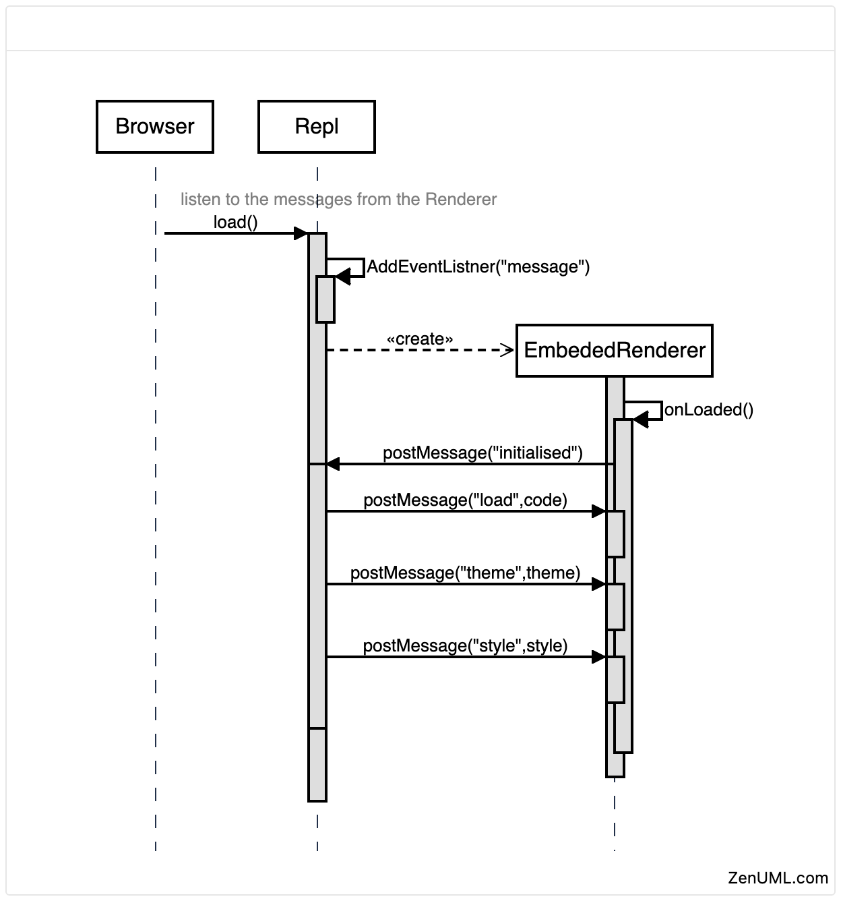

= @zenuml/repl

The REPL is a web-based editor that allows you to create and render ZenUML in your browser. It is a great way to get started with ZenUML.

== How does it work?

=== Initialising the REPL

=== Get code from the REPL

TODO

